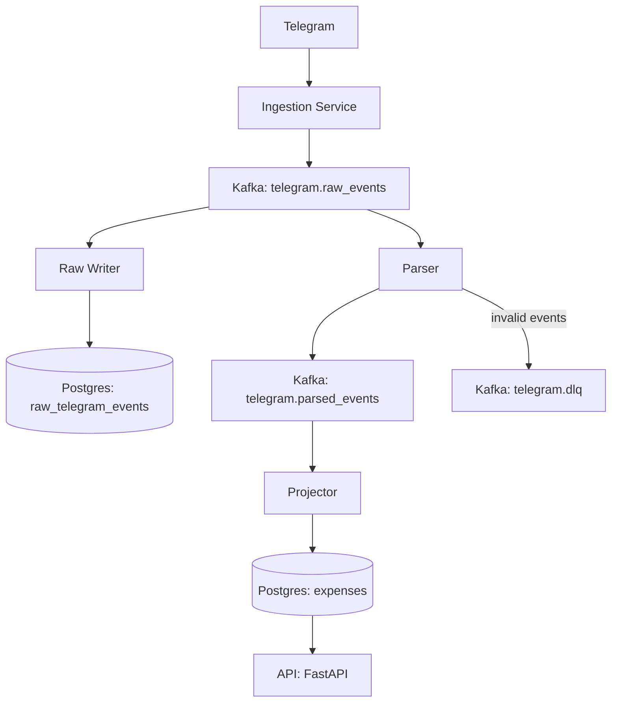

# Telegram Event-Driven Data Platform

A production-like event-driven data platform built from scratch using Telegram as an event source, Kafka as the event log, and PostgreSQL for projections.

## Overview

This project demonstrates how to design and implement a streaming data platform using an event-driven architecture.

User messages from Telegram are ingested, transformed into events, processed via Kafka consumers, and stored as queryable projections in PostgreSQL.

## Architecture



## ⚙️ Components

### 1. Ingestion Service
- Receives Telegram messages
- Converts them into structured events
- Publishes to Kafka topic: `telegram.raw_events`

### 2. Kafka (Event Log)
- Central message broker
- Stores all events
- Enables decoupled processing

### 3. Raw Writer Consumer
- Consumes `telegram.raw_events`
- Stores events in PostgreSQL (`raw_telegram_events`)
- Ensures idempotency via `event_id`

### 4. Parser Consumer
- Parses raw messages into structured business events
- Produces `expense_recorded` events to `telegram.parsed_events`
- Handles invalid input via DLQ

### 5. Projector Consumer
- Builds read models (projections)
- Stores structured data in `expenses` table

### 6. API Layer (FastAPI)
- Exposes projections via REST endpoints
- `/expenses`
- `/expenses/summary`

## Kafka Topics

- `telegram.raw_events` — raw incoming events
- `telegram.parsed_events` — processed business events
- `telegram.dlq` — failed/unprocessable events

## Data Model

### raw_telegram_events
Stores original events as JSON.

### expenses
Projection table with structured data:
- description
- amount
- currency
- user info

## Reliability Features

### Idempotency
- `event_id` used as primary key
- prevents duplicate inserts

### DLQ (Dead Letter Queue)
- invalid events are not dropped
- stored in `telegram.dlq` with error reason

### Producer Reliability
- `acks=all`
- retries enabled
- idempotent producer

### Fault Tolerance
- consumers handle parsing errors gracefully
- system does not crash on bad input

## Tech Stack

- Python
- Apache Kafka
- PostgreSQL
- FastAPI
- Docker Compose

## Run Locally

```
git clone <repo>
cd telegram-event-platform

cp .env.example .env
# add your TELEGRAM_BOT_TOKEN

docker compose up --build
```

## API

Open:

http://localhost:8000/docs

### Example Input

Send message to Telegram bot:

```
coffee 3500
```

Result:

- Raw event stored
- Parsed event created
- Expense saved
- Available via API

## Future Improvements
Shared event schemas across services
Schema validation (Avro / JSON Schema)
Monitoring and alerting
Replay pipelines
Batch processing optimizations
Support for multiple currencies and complex inputs

## Purpose

This project demonstrates:

- Event-driven system design
- Kafka-based data pipelines
- Idempotent processing
- Real-time data transformations
- Production-style architecture

