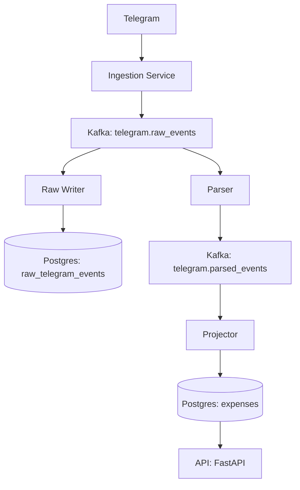

# Architecture

## Overview

This system is designed as an event-driven data platform where all interactions are modeled as immutable events flowing through a central event log.

## High-Level Architecture

    
## Design Principles

### 1. Event-Driven Architecture
All system interactions are modeled as events.

- No direct writes to databases from ingestion
- Kafka is the central communication layer

### 2. Decoupling via Kafka

Services do not depend on each other directly:

- ingestion does not know about Postgres
- parser does not know about API
- projector does not know about ingestion

### 3. Single Responsibility per Service

Each service has a clear role:

| Service       | Responsibility |
|--------------|----------------|
| ingestion    | produce raw events |
| raw_writer   | store raw events |
| parser       | transform events |
| projector    | build projections |
| api          | serve read models |

### 4. Event Log as Source of Truth

Kafka acts as the system’s event log.

- raw events can be replayed
- projections can be rebuilt
- system state is derived from events

## Data Flow

1. User sends message in Telegram
2. Ingestion converts message to event
3. Event is written to `telegram.raw_events`
4. Raw writer persists event in Postgres
5. Parser transforms raw event → business event
6. Projector writes structured data to `expenses`
7. API exposes projections

## Scalability

- Kafka allows horizontal scaling via partitions
- Consumers can be scaled using consumer groups
- Services are independently deployable

## Failure Handling

- Failed parsing → DLQ (`telegram.dlq`)
- Consumer failures → restart and resume from offset
- Idempotent writes prevent duplication

    
