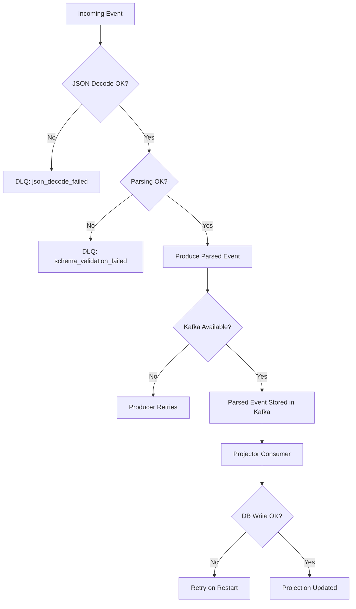

# Reliability

## Goals

- No data loss
- Safe retries
- Graceful handling of invalid data
- Deterministic processing

## Producer Reliability

Kafka producers are configured with:

- `acks=all`
- `retries=3`
- `enable.idempotence=true`

This ensures:
- messages are acknowledged by Kafka
- retries do not create duplicates

## Consumer Reliability

Consumers:
- manually commit offsets
- only commit after successful processing

This ensures:
- no message loss
- safe reprocessing on failure

## Idempotency

Database writes use:

```sql
PRIMARY KEY (event_id)
```
and:

```
ON CONFLICT DO NOTHING
```

## Dead Letter Queue (DLQ)

Invalid or unprocessable events are sent to:

```
telegram.dlq
```

### Reasons include:

- JSON decode failure
- schema validation failure
- unexpected runtime error

### DLQ enables:

- debugging
- replay
- monitoring data quality
- Replay Capability

### Because Kafka stores events:

- consumers can restart
- projections can be rebuilt
- system state can be recomputed

### Failure Scenarios




### Graceful Shutdown
- ingestion flushes Kafka producer
- consumers commit offsets before exit